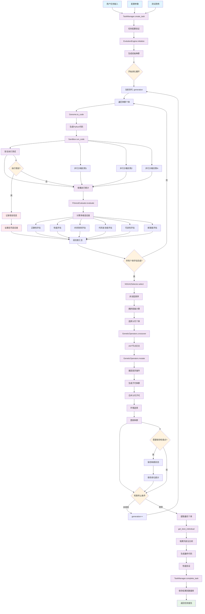

# EvoForge 数据流详细分析报告

## 概述

EvoForge 是一个基于遗传算法的代码自进化系统，通过模拟生物进化过程来自动优化和生成代码。本文档详细分析了系统中数据的完整流转路径，从任务创建到最终解决方案输出的全过程。

## 1. 数据流完整路径描述

### 1.1 数据源与初始函数

#### 数据源
- **用户输入任务**：包含函数签名、测试用例、性能要求等
- **初始种群基因**：随机生成或从种子代码衍生的基因序列
- **配置参数**：进化参数、资源限制、目标权重等

#### 初始函数
1. **TaskManager.create_task()** - 任务创建入口
   - 输入：TaskConfig（任务配置）
   - 输出：task_id（任务标识符）
   - 功能：解析用户需求，创建任务实例，初始化进度跟踪

2. **EvolutionEngine.initialize_population()** - 种群初始化
   - 输入：population_size, function_signature
   - 输出：List[Individual]（初始个体列表）
   - 功能：生成随机基因序列，创建初始代码个体

### 1.2 中间处理函数与结果

#### 核心进化循环（EvolutionEngine.evolve()）

**第一阶段：适应度评估**
1. **evaluate_individual()** - 个体评估
   - 输入：code（Python代码字符串）, test_code（测试用例）
   - 处理：在沙箱中执行代码，运行测试用例
   - 输出：TestResult（测试结果）, SandboxResult（执行统计）

2. **FitnessEvaluator.evaluate()** - 多目标适应度计算
   - 输入：code, test_results, execution_stats
   - 处理：计算正确性、性能、内存、复杂度等10个维度的适应度
   - 输出：FitnessMetrics（多维适应度指标）

**第二阶段：选择与繁殖**
3. **NSGA2Selector.select()** - 多目标选择
   - 输入：population（当前种群）, fitness_scores（适应度分数）
   - 处理：非支配排序，拥挤距离计算，精英选择
   - 输出：selected_parents（选中的父代个体）

4. **GeneticOperators.crossover()** - 基因交叉
   - 输入：parent1, parent2（父代基因）
   - 处理：AST节点交换，语法约束检查
   - 输出：offspring1, offspring2（子代基因）

5. **GeneticOperators.mutate()** - 基因变异
   - 输入：individual（个体基因）, mutation_rate（变异率）
   - 处理：随机节点替换、插入、删除操作
   - 输出：mutated_individual（变异后个体）

**第三阶段：代码生成与验证**
6. **Genome.to_code()** - 基因到代码转换
   - 输入：gene_sequence（基因序列）
   - 处理：AST构建，语法树到Python代码生成
   - 输出：python_code（可执行Python代码）

7. **Sandbox.run_code()** - 安全执行
   - 输入：code（代码）, timeout_sec（超时时间）
   - 处理：Docker容器隔离执行，资源监控
   - 输出：SandboxResult（执行结果和资源使用统计）

### 1.3 最终目标函数与结果

1. **EvolutionEngine.get_best_individual()** - 最优解提取
   - 输入：final_population（最终种群）
   - 处理：帕累托前沿分析，多目标权衡
   - 输出：best_individual（最优个体）

2. **TaskManager.complete_task()** - 任务完成
   - 输入：task_id, best_solution（最优解）
   - 处理：结果验证，性能统计，数据库存储
   - 输出：TaskResult（任务完成报告）

### 1.4 循环与迭代过程

#### 主进化循环
```python
for generation in range(max_generations):
    # 1. 评估当前种群适应度
    fitness_scores = evaluate_population(population)
    
    # 2. 检查收敛条件
    if check_convergence(fitness_scores):
        break
    
    # 3. 选择父代
    parents = selector.select(population, fitness_scores)
    
    # 4. 生成子代
    offspring = generate_offspring(parents)
    
    # 5. 更新种群
    population = update_population(population, offspring)
    
    # 6. 记录统计信息
    update_statistics(generation, population)
```

#### 循环条件与终止
- **最大世代数**：达到预设的最大进化代数
- **适应度收敛**：连续N代最佳适应度变化小于阈值
- **目标达成**：某个个体达到预设的目标适应度
- **资源耗尽**：超过最大执行时间或内存限制
- **用户中断**：手动停止进化过程

### 1.5 业务意义与价值

#### 核心价值
1. **自动化代码优化**：无需人工干预，自动生成高质量代码解决方案
2. **多目标平衡**：同时优化正确性、性能、可读性等多个维度
3. **创新解决方案**：通过进化过程发现人类可能忽略的创新算法
4. **持续改进**：系统能够从历史经验中学习，不断提升解决方案质量

#### 应用场景
- **算法竞赛**：自动生成高效的竞赛解决方案
- **代码重构**：优化现有代码的性能和可维护性
- **教育辅助**：帮助学习者理解不同的编程方法
- **研究工具**：探索程序设计空间，发现新的编程模式

## 2. Mermaid 数据流程图



## 3. 详细技术文档

### 3.1 系统架构概述

EvoForge 采用分层架构设计，主要包含以下几个核心层次：

1. **任务管理层**：负责任务的创建、调度、监控和完成
2. **进化引擎层**：实现遗传算法的核心逻辑
3. **基因表示层**：处理代码的基因编码和解码
4. **评估执行层**：安全执行代码并收集性能指标
5. **数据存储层**：持久化进化过程和结果数据

### 3.2 数据流详细分析

#### 3.2.1 任务创建阶段

**TaskManager.create_task() 函数分析**

该函数是整个数据流的起始点，负责将用户的高级需求转换为系统可处理的任务配置。

```python
async def create_task(self, config: TaskConfig) -> str:
    """
    输入参数：
    - config.name: 任务名称
    - config.function_signature: 目标函数签名
    - config.test_cases: 测试用例列表
    - config.objectives: 优化目标
    - config.population_size: 种群大小
    - config.max_generations: 最大世代数
    
    处理逻辑：
    1. 生成唯一任务ID
    2. 验证配置参数的合法性
    3. 创建数据库记录
    4. 初始化进度跟踪对象
    5. 设置资源限制和执行环境
    
    输出结果：
    - task_id: 全局唯一的任务标识符
    """
```

**数据转换过程**：
- 用户输入的自然语言描述 → 结构化的TaskConfig对象
- 测试用例文本 → 可执行的pytest代码
- 性能要求 → 量化的适应度权重

#### 3.2.2 种群初始化阶段

**EvolutionEngine.initialize_population() 函数分析**

种群初始化是进化算法的基础，决定了搜索空间的覆盖范围和初始多样性。

```python
def initialize_population(self, size: int, signature: str) -> List[Individual]:
    """
    输入参数：
    - size: 种群大小（通常50-200个个体）
    - signature: 函数签名，定义输入输出接口
    
    处理逻辑：
    1. 解析函数签名，提取参数类型和返回类型
    2. 生成随机的AST节点序列
    3. 确保语法正确性和类型一致性
    4. 创建Individual对象，包含基因和元数据
    5. 设置初始的表达调控参数
    
    输出结果：
    - List[Individual]: 初始种群，每个个体包含：
      * genome: 基因序列（AST节点列表）
      * phenotype: 表现型（生成的代码）
      * fitness: 初始适应度（未评估状态）
      * metadata: 元数据（创建时间、世代等）
    """
```

**关键数据结构**：
- **GeneNode**: 增强的基因节点，支持表达调控
- **Individual**: 个体对象，包含基因型和表现型
- **Genome**: 基因组管理器，处理编码解码

#### 3.2.3 适应度评估阶段

这是数据流中最复杂和关键的阶段，涉及代码生成、安全执行和多维度评估。

**Genome.to_code() - 基因到代码转换**

```python
def to_code(self) -> str:
    """
    输入：基因序列（List[GeneNode]）
    
    处理逻辑：
    1. 遍历基因节点，构建AST树
    2. 应用表达调控规则，决定节点激活状态
    3. 进行语法检查和类型推断
    4. 生成符合Python语法的代码字符串
    5. 添加必要的导入语句和异常处理
    
    输出：可执行的Python代码字符串
    
    关键特性：
    - 支持基因表达调控（某些基因可能被沉默）
    - 自动修复常见语法错误
    - 保持代码的可读性和结构化
    """
```

**Sandbox.run_code() - 安全执行**

```python
def run_code(self, code: str, timeout_sec: float) -> SandboxResult:
    """
    输入参数：
    - code: 待执行的Python代码
    - timeout_sec: 执行超时时间
    
    处理逻辑：
    1. 创建隔离的Docker容器
    2. 设置资源限制（CPU、内存、网络）
    3. 将代码和测试用例写入容器
    4. 执行pytest测试框架
    5. 实时监控资源使用情况
    6. 收集执行结果和性能指标
    
    输出结果：
    - SandboxResult包含：
      * exit_code: 程序退出码
      * stdout/stderr: 标准输出和错误输出
      * duration_sec: 执行时间
      * cpu_usage_sec: CPU使用时间
      * max_memory_bytes: 峰值内存使用
      * timed_out: 是否超时
    
    安全特性：
    - 网络隔离，防止恶意网络访问
    - 文件系统只读，防止恶意文件操作
    - 资源限制，防止资源耗尽攻击
    """
```

**FitnessEvaluator.evaluate() - 多维适应度计算**

```python
def evaluate(self, code: str, test_results: Dict, execution_stats: Dict) -> FitnessMetrics:
    """
    输入参数：
    - code: 源代码字符串
    - test_results: 测试执行结果
    - execution_stats: 性能统计数据
    
    处理逻辑：
    1. 正确性评估：
       - 测试通过率 = passed_tests / total_tests
       - 边界情况处理能力
       - 异常处理完整性
    
    2. 性能评估：
       - 时间复杂度分析
       - 相对于基准的执行时间比较
       - 算法效率评分
    
    3. 内存效率评估：
       - 峰值内存使用
       - 内存增长模式
       - 垃圾回收效率
    
    4. 代码质量评估：
       - 圈复杂度（McCabe复杂度）
       - 代码行数和结构复杂度
       - 可读性指标
    
    5. 新颖度评估：
       - 与历史解决方案的差异度
       - 算法创新性评分
       - 代码模式多样性
    
    输出结果：
    - FitnessMetrics对象，包含10个维度的标准化分数（0-1）
    """
```

#### 3.2.4 选择与繁殖阶段

**NSGA2Selector.select() - 多目标选择**

```python
def select(self, population: List[Individual], fitness_scores: List[FitnessMetrics]) -> List[Individual]:
    """
    输入参数：
    - population: 当前种群
    - fitness_scores: 对应的适应度分数
    
    处理逻辑：
    1. 非支配排序：
       - 计算每个个体的支配关系
       - 构建帕累托前沿层次
       - 分配非支配等级
    
    2. 拥挤距离计算：
       - 在同一前沿内计算个体间距离
       - 保持解的多样性
       - 避免过早收敛
    
    3. 精英选择：
       - 优先选择低等级前沿的个体
       - 在同等级内选择拥挤距离大的个体
       - 保持种群大小恒定
    
    输出结果：
    - 选中的父代个体列表，用于后续繁殖
    
    算法特点：
    - 支持多目标优化，无需预设权重
    - 保持解的多样性
    - 计算复杂度O(MN²)，M为目标数，N为种群大小
    """
```

**GeneticOperators.crossover() - 基因交叉**

```python
def crossover(self, parent1: Individual, parent2: Individual) -> Tuple[Individual, Individual]:
    """
    输入参数：
    - parent1, parent2: 父代个体
    
    处理逻辑：
    1. AST节点级交叉：
       - 随机选择交叉点
       - 交换对应的子树结构
       - 保持语法正确性
    
    2. 表达调控交叉：
       - 交换基因表达水平
       - 混合调控因子
       - 传递表观遗传标记
    
    3. 语法修复：
       - 检查类型一致性
       - 修复变量作用域问题
       - 确保函数签名匹配
    
    输出结果：
    - 两个子代个体，继承父代的优秀特征
    
    创新特性：
    - 支持语义感知的交叉操作
    - 保持代码的功能完整性
    - 引入表观遗传机制
    """
```

**GeneticOperators.mutate() - 基因变异**

```python
def mutate(self, individual: Individual, mutation_rate: float) -> Individual:
    """
    输入参数：
    - individual: 待变异的个体
    - mutation_rate: 变异概率
    
    处理逻辑：
    1. 节点级变异：
       - 随机替换AST节点
       - 插入新的代码片段
       - 删除冗余节点
    
    2. 参数级变异：
       - 修改常量值
       - 调整运算符
       - 改变控制流结构
    
    3. 表达调控变异：
       - 随机激活/沉默基因
       - 修改表达水平
       - 添加/删除调控因子
    
    输出结果：
    - 变异后的个体，可能具有新的功能特性
    
    自适应特性：
    - 根据适应度动态调整变异强度
    - 保守区域低变异率，探索区域高变异率
    - 支持定向变异和随机变异
    """
```

#### 3.2.5 收敛检测与结果输出

**收敛条件检测**

系统实现了多种收敛检测机制：

1. **适应度收敛**：连续N代最佳适应度变化小于阈值
2. **多样性收敛**：种群多样性指标低于阈值
3. **目标达成**：某个个体达到预设的目标适应度
4. **资源限制**：达到最大世代数或执行时间

**最优解提取**

```python
def get_best_individual(self, population: List[Individual]) -> Individual:
    """
    输入：最终种群
    
    处理逻辑：
    1. 帕累托前沿分析：
       - 识别非支配解集合
       - 计算理想点距离
       - 应用决策者偏好
    
    2. 多目标权衡：
       - 根据任务配置的目标权重
       - 计算加权适应度分数
       - 选择综合性能最佳的个体
    
    3. 解的验证：
       - 重新执行测试用例
       - 验证性能指标
       - 确保解的稳定性
    
    输出：最优个体及其详细评估报告
    """
```

### 3.3 系统性能与优化

#### 3.3.1 并行化策略

EvoForge 实现了多层次的并行化：

1. **个体级并行**：同时评估多个个体的适应度
2. **测试级并行**：并行执行不同的测试用例
3. **目标级并行**：并行计算不同的适应度维度
4. **种群级并行**：支持多种群协同进化

#### 3.3.2 内存管理

- **增量式垃圾回收**：定期清理无用的个体和中间结果
- **内存池技术**：重用沙箱容器和评估环境
- **流式处理**：大种群分批处理，避免内存溢出

#### 3.3.3 缓存机制

- **代码缓存**：相同基因序列的代码生成结果缓存
- **评估缓存**：相同代码的适应度评估结果缓存
- **测试缓存**：测试用例执行结果缓存

### 3.4 错误处理与容错机制

#### 3.4.1 代码生成错误

- **语法错误修复**：自动修复常见的语法问题
- **类型错误处理**：类型不匹配时的自动转换
- **运行时错误捕获**：异常情况下的优雅降级

#### 3.4.2 执行环境错误

- **沙箱故障恢复**：容器崩溃时的自动重启
- **资源耗尽处理**：内存或CPU超限时的处理策略
- **网络异常处理**：分布式环境下的网络故障恢复

#### 3.4.3 数据一致性保障

- **检查点机制**：定期保存进化状态
- **事务性操作**：数据库操作的原子性保证
- **版本控制**：种群和个体的版本管理

### 3.5 扩展性与可维护性

#### 3.5.1 模块化设计

- **插件式架构**：支持自定义适应度函数和遗传算子
- **配置驱动**：通过配置文件调整算法参数
- **接口标准化**：统一的API接口设计

#### 3.5.2 监控与调试

- **实时监控**：进化过程的实时可视化
- **详细日志**：完整的执行轨迹记录
- **性能分析**：瓶颈识别和优化建议

## 4. 总结

EvoForge 的数据流设计体现了现代进化计算系统的先进理念：

1. **多目标优化**：同时考虑正确性、性能、可读性等多个维度
2. **安全执行**：通过沙箱技术确保代码执行的安全性
3. **智能调控**：引入基因表达调控机制，提高进化效率
4. **并行处理**：充分利用现代多核处理器的计算能力
5. **容错设计**：完善的错误处理和恢复机制

该系统不仅能够自动生成高质量的代码解决方案，还为代码进化和程序合成领域的研究提供了强大的实验平台。通过持续的优化和扩展，EvoForge 有望成为下一代智能编程工具的重要组成部分。