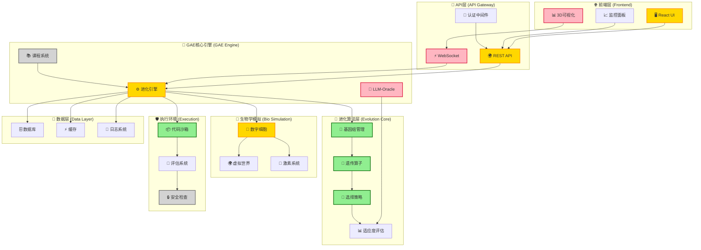
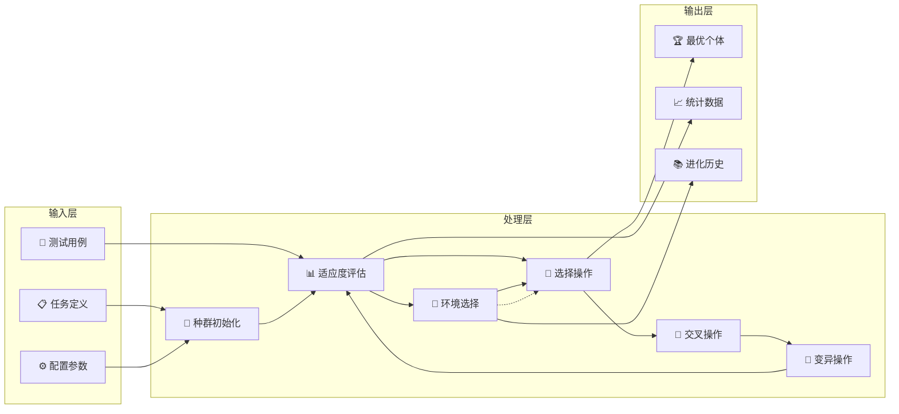
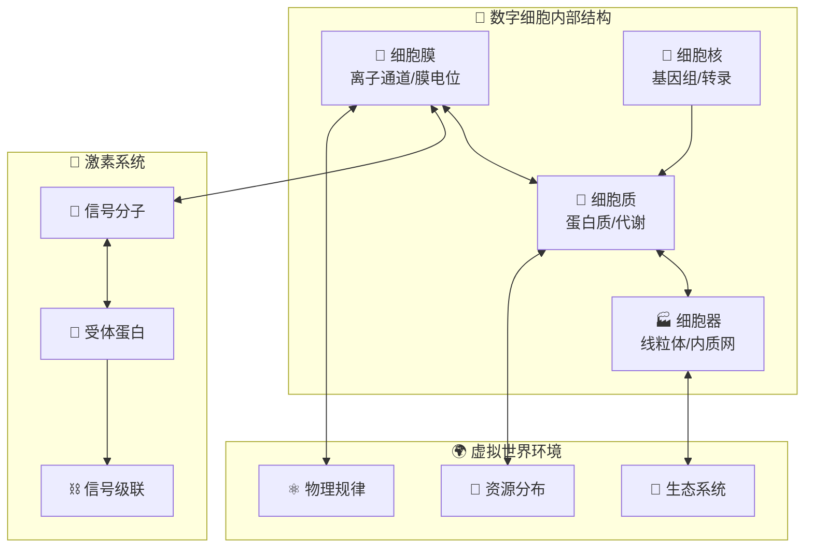
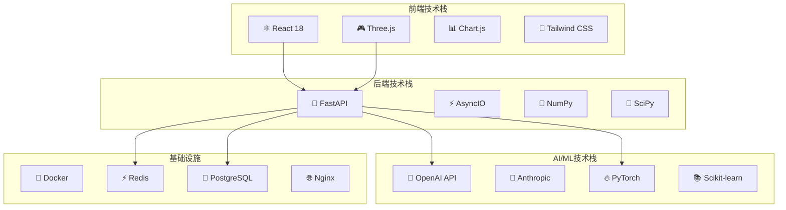
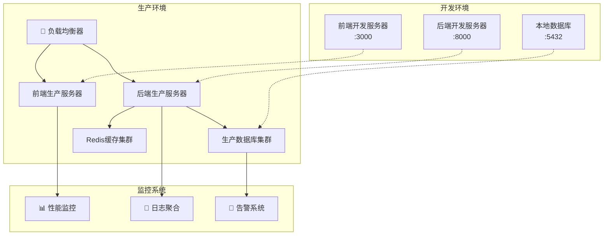
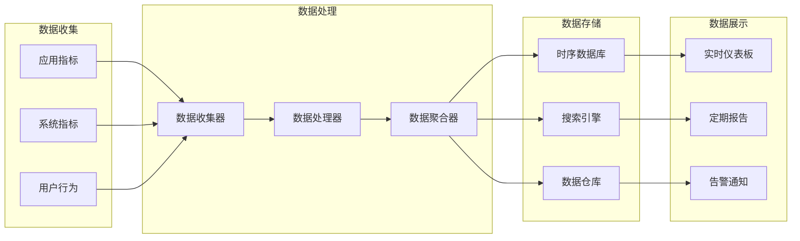
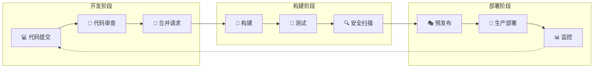

# EvoForge架构可视化图

## 🏗️ 系统架构总览

## 📊 模块状态详细分析

### ✅ 已完成模块 (绿色)
- **基因组管理** (`genome.py`) - 完整实现
- **遗传算子** (`operators.py`) - 交叉变异完备
- **选择策略** (`selection.py`) - 多种算法支持
- **代码沙箱** (`sandbox.py`) - 安全执行环境

### 🟡 部分完成模块 (黄色)
- **进化引擎** (`engine.py`) - 核心功能完成，需重构
- **数字细胞** (`consciousness.py`) - 基础模拟完成
- **REST API** - 基本接口可用
- **React UI** - 主要页面完成

### 🔴 问题模块 (红色)
- **3D可视化** - Three.js集成问题
- **WebSocket** - 连接不稳定
- **LLM-Oracle** - 实现不完整

### ⚪ 缺失模块 (灰色)
- **课程系统** - 未开始实现
- **安全检查** - 代码安全扫描缺失

---

## 🔄 数据流图

---

## 🧬 生物学模拟架构

---

## 🔧 技术栈架构

---

## 🚀 部署架构

---

## 📈 性能监控架构

---

## 🔄 CI/CD流水线

---

**图表说明**:
- 🟢 绿色: 功能完整，运行稳定
- 🟡 黄色: 基本功能完成，需要优化
- 🔴 红色: 存在问题，需要修复
- ⚪ 灰色: 功能缺失，需要实现

**更新时间**: 2024年12月19日  
**版本**: v1.0