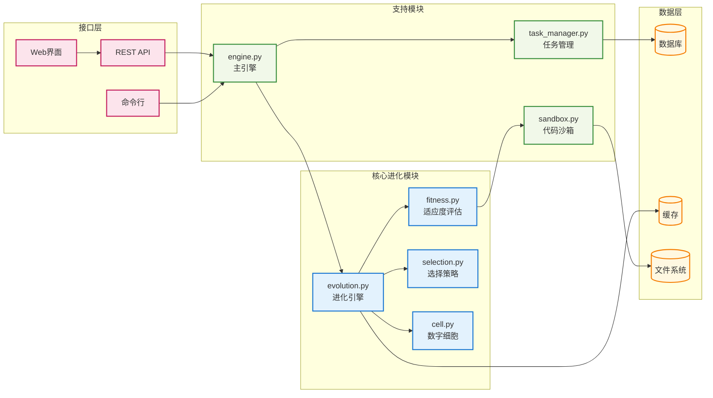
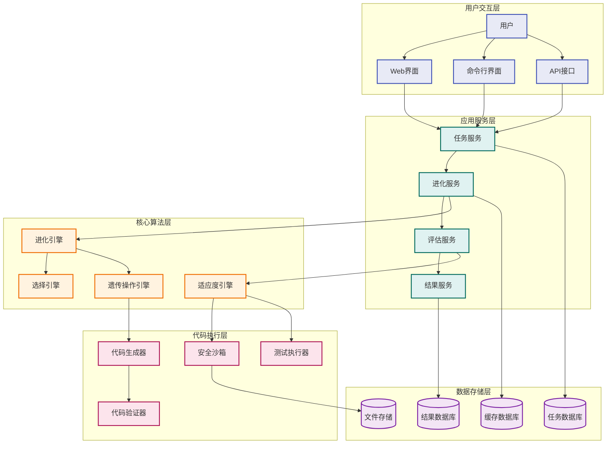

# EvoForge 进化算法流程图设计文档

## 概述

本文档基于 EvoForge 数据流详细分析报告，设计了完整的进化算法流程图，包括核心算法流程、模块交互关系和系统架构图。

## 1. 核心进化算法流程图

### 1.1 主流程 Mermaid 图

```mermaid
flowchart TD
    %% 系统初始化
    START([开始]) --> INIT[系统初始化]
    INIT --> CONFIG[加载配置参数]
    CONFIG --> TASK[创建进化任务]
    
    %% 任务配置
    TASK --> VALIDATE[验证任务配置]
    VALIDATE --> |有效| SETUP[设置进化环境]
    VALIDATE --> |无效| ERROR1[配置错误]
    ERROR1 --> END1([结束])
    
    %% 种群初始化
    SETUP --> INIT_POP[初始化种群]
    INIT_POP --> GEN_GENES[生成随机基因]
    GEN_GENES --> CREATE_INDIVIDUALS[创建个体]
    CREATE_INDIVIDUALS --> POPULATION[初始种群]
    
    %% 主进化循环
    POPULATION --> EVOLUTION_LOOP{开始进化循环}
    EVOLUTION_LOOP --> GEN_COUNT[当前世代: G]
    
    %% 适应度评估阶段
    GEN_COUNT --> EVAL_START[开始适应度评估]
    EVAL_START --> FOR_EACH[遍历每个个体]
    FOR_EACH --> GENOME_TO_CODE[基因→代码转换]
    GENOME_TO_CODE --> SYNTAX_CHECK[语法检查]
    SYNTAX_CHECK --> |通过| SANDBOX[沙箱执行]
    SYNTAX_CHECK --> |失败| SYNTAX_ERROR[语法错误惩罚]
    
    %% 代码执行与测试
    SANDBOX --> RUN_TESTS[运行测试用例]
    RUN_TESTS --> COLLECT_STATS[收集执行统计]
    COLLECT_STATS --> MULTI_FITNESS[多维适应度计算]
    SYNTAX_ERROR --> MULTI_FITNESS
    
    %% 适应度计算详细
    MULTI_FITNESS --> CORRECTNESS[正确性评估]
    MULTI_FITNESS --> PERFORMANCE[性能评估]
    MULTI_FITNESS --> MEMORY[内存效率]
    MULTI_FITNESS --> COMPLEXITY[代码复杂度]
    MULTI_FITNESS --> READABILITY[可读性评估]
    MULTI_FITNESS --> NOVELTY[新颖度评估]
    
    CORRECTNESS --> FITNESS_MERGE[适应度汇总]
    PERFORMANCE --> FITNESS_MERGE
    MEMORY --> FITNESS_MERGE
    COMPLEXITY --> FITNESS_MERGE
    READABILITY --> FITNESS_MERGE
    NOVELTY --> FITNESS_MERGE
    
    %% 评估完成检查
    FITNESS_MERGE --> EVAL_CHECK{所有个体评估完成?}
    EVAL_CHECK --> |否| FOR_EACH
    EVAL_CHECK --> |是| SELECTION_START[开始选择阶段]
    
    %% 选择阶段
    SELECTION_START --> NSGA2[NSGA-II选择]
    NSGA2 --> NON_DOMINATED[非支配排序]
    NON_DOMINATED --> CROWDING[拥挤距离计算]
    CROWDING --> SELECT_PARENTS[选择父代]
    
    %% 遗传操作阶段
    SELECT_PARENTS --> GENETIC_OPS[遗传操作]
    GENETIC_OPS --> CROSSOVER[交叉操作]
    CROSSOVER --> MUTATION[变异操作]
    MUTATION --> OFFSPRING[生成子代]
    
    %% 种群更新
    OFFSPRING --> COMBINE[合并父代子代]
    COMBINE --> ENV_SELECTION[环境选择]
    ENV_SELECTION --> UPDATE_POP[更新种群]
    
    %% 终止条件检查
    UPDATE_POP --> TERMINATION{检查终止条件}
    TERMINATION --> |最大世代| EXTRACT_BEST[提取最优解]
    TERMINATION --> |适应度收敛| EXTRACT_BEST
    TERMINATION --> |目标达成| EXTRACT_BEST
    TERMINATION --> |资源耗尽| EXTRACT_BEST
    TERMINATION --> |用户中断| EXTRACT_BEST
    TERMINATION --> |继续进化| GEN_INCREMENT[世代+1]
    
    GEN_INCREMENT --> GEN_COUNT
    
    %% 结果处理
    EXTRACT_BEST --> PARETO_ANALYSIS[帕累托前沿分析]
    PARETO_ANALYSIS --> BEST_INDIVIDUAL[最优个体]
    BEST_INDIVIDUAL --> FINAL_CODE[生成最终代码]
    FINAL_CODE --> VALIDATION[最终验证]
    VALIDATION --> TASK_COMPLETE[任务完成]
    TASK_COMPLETE --> SAVE_RESULTS[保存结果]
    SAVE_RESULTS --> END2([结束])
    
    %% 样式定义
    classDef startEnd fill:#e1f5fe,stroke:#01579b,stroke-width:2px
    classDef process fill:#f3e5f5,stroke:#4a148c,stroke-width:2px
    classDef decision fill:#fff3e0,stroke:#e65100,stroke-width:2px
    classDef error fill:#ffebee,stroke:#c62828,stroke-width:2px
    classDef genetic fill:#e8f5e8,stroke:#2e7d32,stroke-width:2px
    
    class START,END1,END2 startEnd
    class INIT,CONFIG,TASK,SETUP,INIT_POP,GEN_GENES,CREATE_INDIVIDUALS process
    class VALIDATE,EVOLUTION_LOOP,EVAL_CHECK,TERMINATION decision
    class ERROR1,SYNTAX_ERROR error
    class CROSSOVER,MUTATION,GENETIC_OPS genetic
```

### 1.2 模块交互关系图

## 2. 详细算法流程说明

### 2.1 适应度评估流程

适应度评估是进化算法的核心，包含以下六个维度：

1. **正确性评估** (40%权重)
   - 测试用例通过率
   - 边界条件处理
   - 异常处理能力

2. **性能评估** (25%权重)
   - 执行时间
   - 时间复杂度
   - 算法效率

3. **内存效率** (15%权重)
   - 内存使用量
   - 空间复杂度
   - 内存泄漏检测

4. **代码复杂度** (10%权重)
   - 圈复杂度
   - 代码行数
   - 嵌套深度

5. **可读性评估** (5%权重)
   - 变量命名
   - 代码结构
   - 注释质量

6. **新颖度评估** (5%权重)
   - 算法创新性
   - 解决方案独特性
   - 与历史解的差异度

### 2.2 选择策略详解

#### NSGA-II 多目标选择

1. **非支配排序**
   - 计算每个个体的支配关系
   - 构建非支配层级
   - 分配排序等级

2. **拥挤距离计算**
   - 计算目标空间中的拥挤程度
   - 保持解的多样性
   - 避免过早收敛

3. **精英选择**
   - 优先选择低等级个体
   - 同等级内选择拥挤距离大的个体
   - 保持种群规模稳定

### 2.3 遗传操作详解

#### 交叉操作

1. **AST节点交叉**
   - 解析代码为抽象语法树
   - 随机选择交叉点
   - 交换子树结构
   - 保证语法正确性

2. **语义保持交叉**
   - 保持函数签名不变
   - 维护变量作用域
   - 确保类型一致性

#### 变异操作

1. **节点替换变异**
   - 随机选择AST节点
   - 替换为同类型节点
   - 保持语法结构

2. **插入/删除变异**
   - 插入新的代码片段
   - 删除冗余代码
   - 调整代码结构

## 3. 系统架构图

### 3.1 整体架构

## 4. 性能优化策略

### 4.1 并行化优化

1. **种群并行评估**
   - 多进程并行执行个体评估
   - GPU加速适应度计算
   - 分布式计算支持

2. **遗传操作并行化**
   - 并行交叉操作
   - 并行变异操作
   - 异步种群更新

### 4.2 缓存优化

1. **适应度缓存**
   - 基于代码哈希的缓存
   - LRU缓存策略
   - 分布式缓存支持

2. **代码生成缓存**
   - AST结构缓存
   - 编译结果缓存
   - 测试结果缓存

### 4.3 内存优化

1. **种群管理**
   - 延迟加载策略
   - 内存池管理
   - 垃圾回收优化

2. **数据结构优化**
   - 紧凑的基因表示
   - 高效的适应度存储
   - 流式数据处理

## 5. 监控与调试

### 5.1 实时监控

1. **进化过程监控**
   - 适应度变化趋势
   - 种群多样性指标
   - 收敛速度分析

2. **系统性能监控**
   - CPU使用率
   - 内存使用情况
   - 磁盘I/O统计

### 5.2 调试支持

1. **详细日志记录**
   - 分级日志系统
   - 结构化日志格式
   - 实时日志查看

2. **可视化调试**
   - 进化过程可视化
   - 适应度分布图
   - 种群结构展示

## 6. 扩展性设计

### 6.1 算法扩展

1. **新选择策略**
   - 插件化选择器接口
   - 动态策略切换
   - 自适应参数调整

2. **新遗传操作**
   - 可配置的操作算子
   - 领域特定的操作
   - 机器学习辅助操作

### 6.2 平台扩展

1. **多语言支持**
   - 可扩展的代码生成器
   - 语言特定的评估器
   - 跨语言优化

2. **云原生部署**
   - 容器化部署
   - 微服务架构
   - 弹性伸缩支持

---

**文档版本**: 1.0  
**创建日期**: 2024年12月  
**最后更新**: 2024年12月  
**维护者**: EvoForge Team