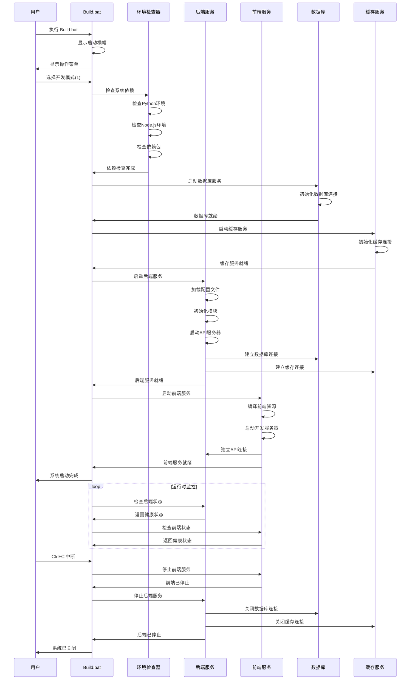
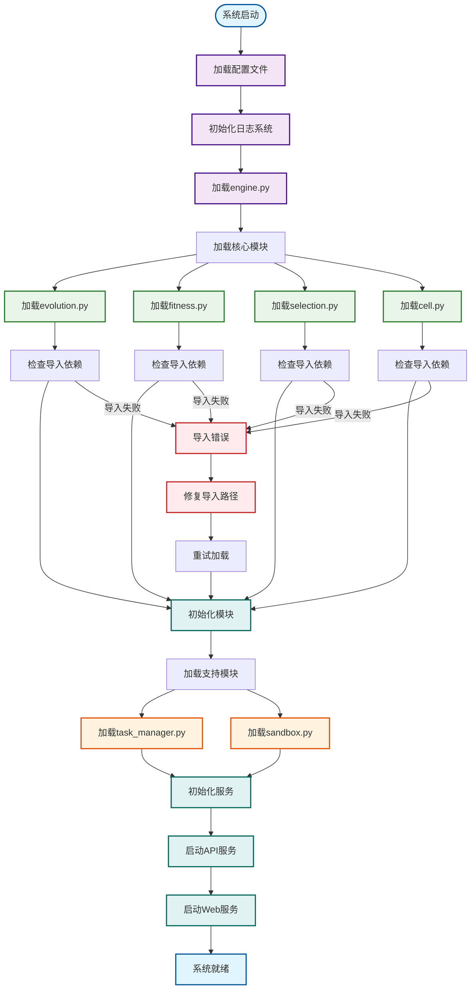
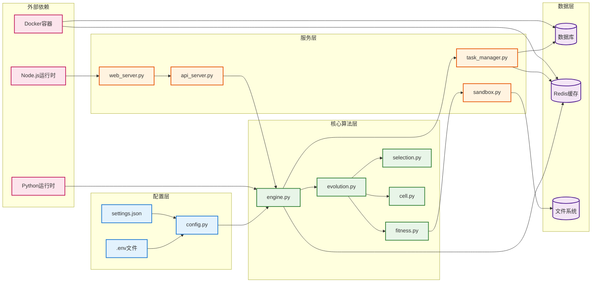
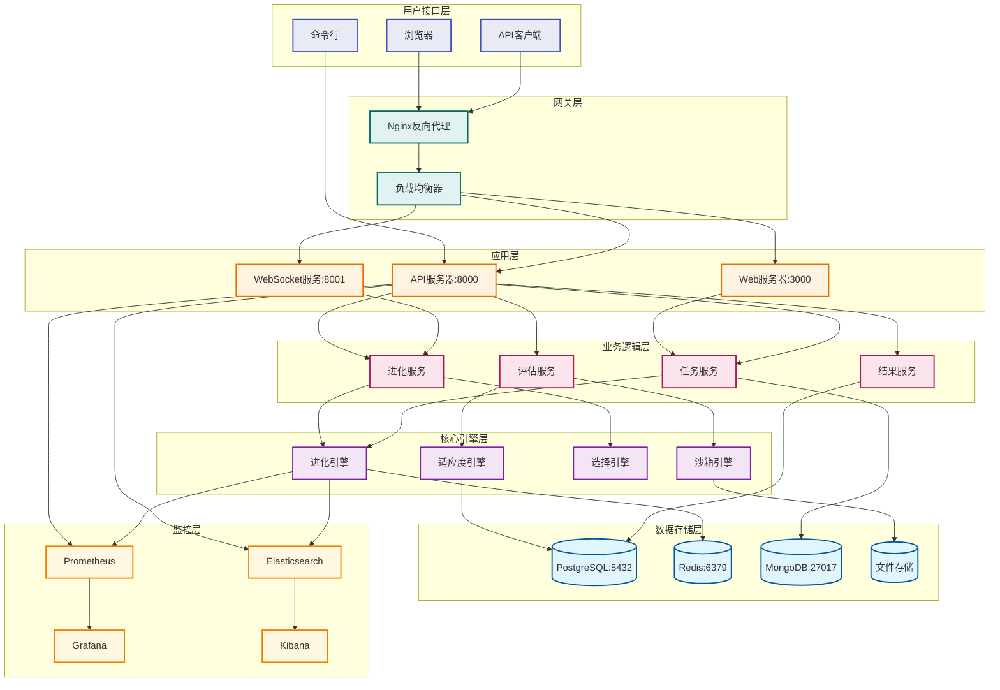
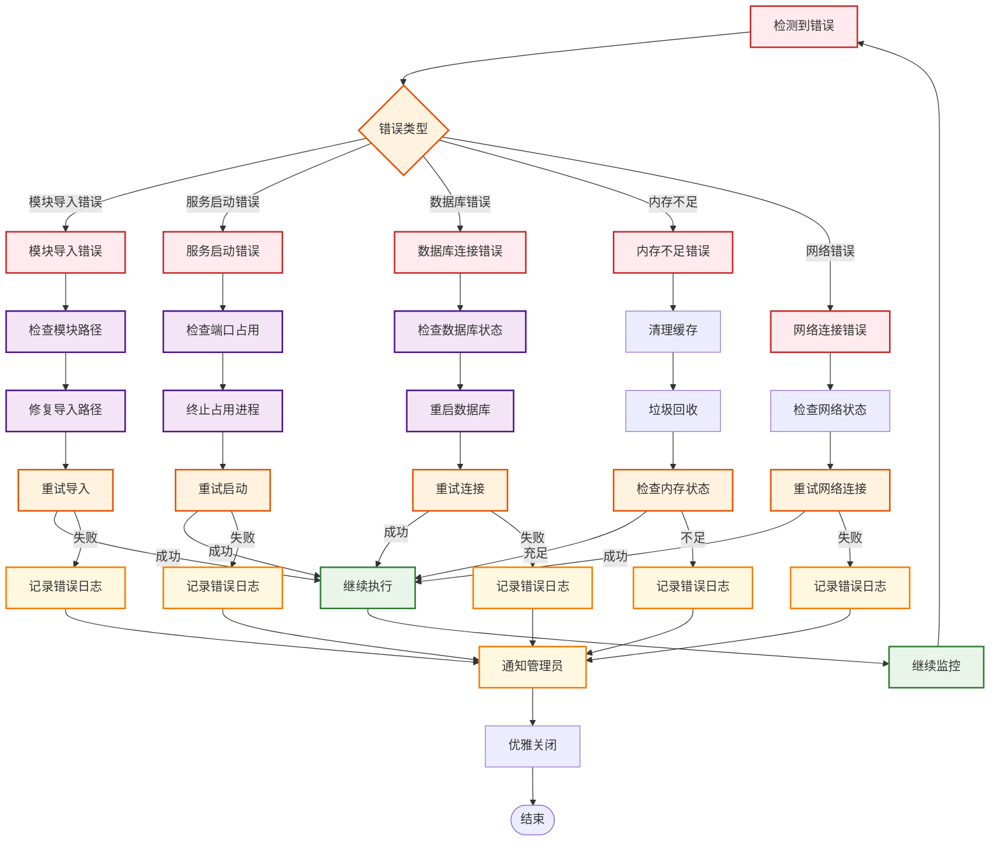
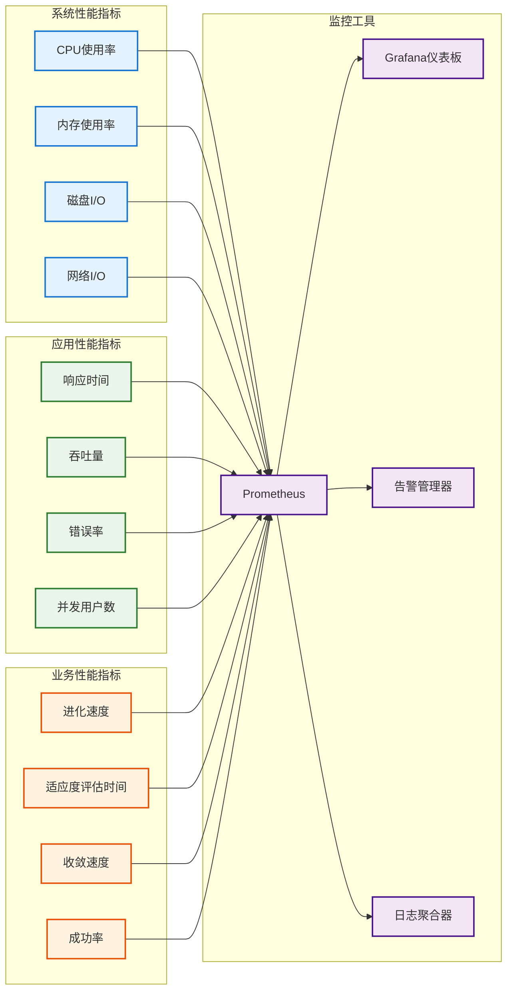

# EvoForge 项目运行流程图

## 概述

本文档详细描述了 EvoForge 项目的完整运行流程，包括启动脚本 Build.bat 的执行流程、系统初始化过程、服务启动顺序和运行时架构。

## 1. Build.bat 启动流程图

### 1.1 主启动流程

```mermaid
flowchart TD
    START([启动 Build.bat]) --> BANNER[显示喀迈拉计划横幅]
    BANNER --> MENU[显示操作菜单]
    
    MENU --> CHOICE{用户选择}
    
    %% 开发模式 (选项1)
    CHOICE --> |1| DEV_MODE[开发模式]
    DEV_MODE --> CHECK_DEPS1[检查依赖]
    CHECK_DEPS1 --> INSTALL_DEPS1[安装依赖]
    INSTALL_DEPS1 --> START_BACKEND1[启动后端服务]
    START_BACKEND1 --> START_FRONTEND1[启动前端服务]
    START_FRONTEND1 --> DEV_RUNNING[开发环境运行中]
    
    %% 生产模式 (选项2)
    CHOICE --> |2| PROD_MODE[生产模式]
    PROD_MODE --> CHECK_DEPS2[检查依赖]
    CHECK_DEPS2 --> BUILD_PROD[构建生产版本]
    BUILD_PROD --> DOCKER_BUILD[Docker构建]
    DOCKER_BUILD --> DOCKER_COMPOSE[启动Docker Compose]
    DOCKER_COMPOSE --> PROD_RUNNING[生产环境运行中]
    
    %% 仅后端 (选项3)
    CHOICE --> |3| BACKEND_ONLY[仅启动后端]
    BACKEND_ONLY --> CHECK_BACKEND[检查后端依赖]
    CHECK_BACKEND --> START_BACKEND_ONLY[启动后端服务]
    START_BACKEND_ONLY --> BACKEND_RUNNING[后端服务运行中]
    
    %% 仅前端 (选项4)
    CHOICE --> |4| FRONTEND_ONLY[仅启动前端]
    FRONTEND_ONLY --> CHECK_FRONTEND[检查前端依赖]
    CHECK_FRONTEND --> START_FRONTEND_ONLY[启动前端服务]
    START_FRONTEND_ONLY --> FRONTEND_RUNNING[前端服务运行中]
    
    %% 初始化项目 (选项5)
    CHOICE --> |5| INIT_PROJECT[初始化项目]
    INIT_PROJECT --> SETUP_ENV[设置环境变量]
    SETUP_ENV --> INSTALL_ALL_DEPS[安装所有依赖]
    INSTALL_ALL_DEPS --> SETUP_DATABASE[设置数据库]
    SETUP_DATABASE --> INIT_CONFIG[初始化配置]
    INIT_CONFIG --> INIT_COMPLETE[初始化完成]
    
    %% 清理项目 (选项6)
    CHOICE --> |6| CLEAN_PROJECT[清理项目]
    CLEAN_PROJECT --> STOP_SERVICES[停止所有服务]
    STOP_SERVICES --> CLEAN_CACHE[清理缓存]
    CLEAN_CACHE --> CLEAN_LOGS[清理日志]
    CLEAN_LOGS --> CLEAN_TEMP[清理临时文件]
    CLEAN_TEMP --> CLEAN_COMPLETE[清理完成]
    
    %% 退出 (选项7)
    CHOICE --> |7| EXIT[退出程序]
    EXIT --> END([结束])
    
    %% 运行状态循环
    DEV_RUNNING --> MONITOR1[监控服务状态]
    PROD_RUNNING --> MONITOR2[监控服务状态]
    BACKEND_RUNNING --> MONITOR3[监控后端状态]
    FRONTEND_RUNNING --> MONITOR4[监控前端状态]
    
    MONITOR1 --> |服务异常| RESTART1[重启服务]
    MONITOR2 --> |服务异常| RESTART2[重启服务]
    MONITOR3 --> |服务异常| RESTART3[重启后端]
    MONITOR4 --> |服务异常| RESTART4[重启前端]
    
    RESTART1 --> DEV_RUNNING
    RESTART2 --> PROD_RUNNING
    RESTART3 --> BACKEND_RUNNING
    RESTART4 --> FRONTEND_RUNNING
    
    MONITOR1 --> |用户中断| STOP1[停止服务]
    MONITOR2 --> |用户中断| STOP2[停止服务]
    MONITOR3 --> |用户中断| STOP3[停止服务]
    MONITOR4 --> |用户中断| STOP4[停止服务]
    
    STOP1 --> END
    STOP2 --> END
    STOP3 --> END
    STOP4 --> END
    
    INIT_COMPLETE --> MENU
    CLEAN_COMPLETE --> MENU
    
    %% 样式定义
    classDef start fill:#e1f5fe,stroke:#01579b,stroke-width:2px
    classDef process fill:#f3e5f5,stroke:#4a148c,stroke-width:2px
    classDef decision fill:#fff3e0,stroke:#e65100,stroke-width:2px
    classDef running fill:#e8f5e8,stroke:#2e7d32,stroke-width:2px
    classDef error fill:#ffebee,stroke:#c62828,stroke-width:2px
    
    class START,END start
    class BANNER,MENU,CHECK_DEPS1,INSTALL_DEPS1,START_BACKEND1,START_FRONTEND1 process
    class CHOICE,MONITOR1,MONITOR2,MONITOR3,MONITOR4 decision
    class DEV_RUNNING,PROD_RUNNING,BACKEND_RUNNING,FRONTEND_RUNNING running
```

### 1.2 依赖检查与安装流程

```mermaid
flowchart TD
    START_CHECK([开始依赖检查]) --> CHECK_PYTHON[检查Python环境]
    CHECK_PYTHON --> |存在| CHECK_PIP[检查pip]
    CHECK_PYTHON --> |不存在| INSTALL_PYTHON[安装Python]
    INSTALL_PYTHON --> CHECK_PIP
    
    CHECK_PIP --> |存在| CHECK_NODE[检查Node.js]
    CHECK_PIP --> |不存在| INSTALL_PIP[安装pip]
    INSTALL_PIP --> CHECK_NODE
    
    CHECK_NODE --> |存在| CHECK_NPM[检查npm]
    CHECK_NODE --> |不存在| INSTALL_NODE[安装Node.js]
    INSTALL_NODE --> CHECK_NPM
    
    CHECK_NPM --> |存在| CHECK_REQUIREMENTS[检查requirements.txt]
    CHECK_NPM --> |不存在| INSTALL_NPM[安装npm]
    INSTALL_NPM --> CHECK_REQUIREMENTS
    
    CHECK_REQUIREMENTS --> |存在| INSTALL_PYTHON_DEPS[安装Python依赖]
    CHECK_REQUIREMENTS --> |不存在| CREATE_REQUIREMENTS[创建requirements.txt]
    CREATE_REQUIREMENTS --> INSTALL_PYTHON_DEPS
    
    INSTALL_PYTHON_DEPS --> CHECK_PACKAGE_JSON[检查package.json]
    CHECK_PACKAGE_JSON --> |存在| INSTALL_NODE_DEPS[安装Node.js依赖]
    CHECK_PACKAGE_JSON --> |不存在| CREATE_PACKAGE_JSON[创建package.json]
    CREATE_PACKAGE_JSON --> INSTALL_NODE_DEPS
    
    INSTALL_NODE_DEPS --> CHECK_ENV[检查环境变量]
    CHECK_ENV --> |配置完整| DEPS_COMPLETE[依赖检查完成]
    CHECK_ENV --> |配置缺失| SETUP_ENV[设置环境变量]
    SETUP_ENV --> DEPS_COMPLETE
    
    DEPS_COMPLETE --> END_CHECK([依赖检查结束])
    
    %% 样式定义
    classDef start fill:#e1f5fe,stroke:#01579b,stroke-width:2px
    classDef process fill:#f3e5f5,stroke:#4a148c,stroke-width:2px
    classDef decision fill:#fff3e0,stroke:#e65100,stroke-width:2px
    classDef success fill:#e8f5e8,stroke:#2e7d32,stroke-width:2px
    
    class START_CHECK,END_CHECK start
    class INSTALL_PYTHON,INSTALL_PIP,INSTALL_NODE,INSTALL_NPM,INSTALL_PYTHON_DEPS,INSTALL_NODE_DEPS process
    class CHECK_PYTHON,CHECK_PIP,CHECK_NODE,CHECK_NPM,CHECK_REQUIREMENTS,CHECK_PACKAGE_JSON,CHECK_ENV decision
    class DEPS_COMPLETE success
```

## 2. 系统启动序列图

### 2.1 完整系统启动序列

## 3. 模块加载与初始化流程

### 3.1 核心模块加载顺序

### 3.2 模块依赖关系图

## 4. 运行时架构图

### 4.1 系统运行时架构

## 5. 错误处理与恢复流程

### 5.1 系统错误处理流程

## 6. 性能监控与优化

### 6.1 性能监控指标

## 7. 部署架构图

### 7.1 Docker容器化部署

```mermaid
flowchart TB
    %% 宿主机层
    subgraph "宿主机环境"
        HOST_OS[宿主机操作系统]
        DOCKER_ENGINE[Docker引擎]
    end
    
    %% 容器层
    subgraph "容器层"
        subgraph "前端容器"
            NGINX_CONTAINER[Nginx容器]
            FRONTEND_CONTAINER[前端应用容器]
        end
        
        subgraph "后端容器"
            API_CONTAINER[API服务容器]
            EVOLUTION_CONTAINER[进化引擎容器]
            WORKER_CONTAINER[工作进程容器]
        end
        
        subgraph "数据容器"
            POSTGRES_CONTAINER[PostgreSQL容器]
            REDIS_CONTAINER[Redis容器]
            MONGO_CONTAINER[MongoDB容器]
        end
        
        subgraph "监控容器"
            PROMETHEUS_CONTAINER[Prometheus容器]
            GRAFANA_CONTAINER[Grafana容器]
        end
    end
    
    %% 存储层
    subgraph "存储层"
        DATA_VOLUME[数据卷]
        LOG_VOLUME[日志卷]
        CONFIG_VOLUME[配置卷]
    end
    
    %% 网络层
    subgraph "网络层"
        FRONTEND_NETWORK[前端网络]
        BACKEND_NETWORK[后端网络]
        DATABASE_NETWORK[数据库网络]
        MONITORING_NETWORK[监控网络]
    end
    
    %% 连接关系
    HOST_OS --> DOCKER_ENGINE
    DOCKER_ENGINE --> NGINX_CONTAINER
    DOCKER_ENGINE --> FRONTEND_CONTAINER
    DOCKER_ENGINE --> API_CONTAINER
    DOCKER_ENGINE --> EVOLUTION_CONTAINER
    DOCKER_ENGINE --> WORKER_CONTAINER
    DOCKER_ENGINE --> POSTGRES_CONTAINER
    DOCKER_ENGINE --> REDIS_CONTAINER
    DOCKER_ENGINE --> MONGO_CONTAINER
    DOCKER_ENGINE --> PROMETHEUS_CONTAINER
    DOCKER_ENGINE --> GRAFANA_CONTAINER
    
    POSTGRES_CONTAINER --> DATA_VOLUME
    REDIS_CONTAINER --> DATA_VOLUME
    MONGO_CONTAINER --> DATA_VOLUME
    
    API_CONTAINER --> LOG_VOLUME
    EVOLUTION_CONTAINER --> LOG_VOLUME
    
    NGINX_CONTAINER --> CONFIG_VOLUME
    API_CONTAINER --> CONFIG_VOLUME
    
    NGINX_CONTAINER --> FRONTEND_NETWORK
    FRONTEND_CONTAINER --> FRONTEND_NETWORK
    
    API_CONTAINER --> BACKEND_NETWORK
    EVOLUTION_CONTAINER --> BACKEND_NETWORK
    WORKER_CONTAINER --> BACKEND_NETWORK
    
    POSTGRES_CONTAINER --> DATABASE_NETWORK
    REDIS_CONTAINER --> DATABASE_NETWORK
    MONGO_CONTAINER --> DATABASE_NETWORK
    
    PROMETHEUS_CONTAINER --> MONITORING_NETWORK
    GRAFANA_CONTAINER --> MONITORING_NETWORK
    
    %% 样式定义
    classDef host fill:#e1f5fe,stroke:#01579b,stroke-width:2px
    classDef frontend fill:#e8f5e8,stroke:#2e7d32,stroke-width:2px
    classDef backend fill:#fff3e0,stroke:#e65100,stroke-width:2px
    classDef data fill:#f3e5f5,stroke:#4a148c,stroke-width:2px
    classDef monitoring fill:#fce4ec,stroke:#c2185b,stroke-width:2px
    classDef storage fill:#e0f2f1,stroke:#00695c,stroke-width:2px
    classDef network fill:#fff8e1,stroke:#f57c00,stroke-width:2px
    
    class HOST_OS,DOCKER_ENGINE host
    class NGINX_CONTAINER,FRONTEND_CONTAINER frontend
    class API_CONTAINER,EVOLUTION_CONTAINER,WORKER_CONTAINER backend
    class POSTGRES_CONTAINER,REDIS_CONTAINER,MONGO_CONTAINER data
    class PROMETHEUS_CONTAINER,GRAFANA_CONTAINER monitoring
    class DATA_VOLUME,LOG_VOLUME,CONFIG_VOLUME storage
    class FRONTEND_NETWORK,BACKEND_NETWORK,DATABASE_NETWORK,MONITORING_NETWORK network
```

## 8. 总结

本文档详细描述了 EvoForge 项目的完整运行流程，包括：

1. **Build.bat 启动脚本流程** - 提供多种启动模式和完整的错误处理
2. **系统初始化序列** - 确保所有组件按正确顺序启动
3. **模块加载流程** - 解决模块依赖和导入问题
4. **运行时架构** - 展示系统的完整架构和组件交互
5. **错误处理机制** - 提供完善的错误恢复策略
6. **性能监控体系** - 实时监控系统性能和业务指标
7. **容器化部署** - 支持Docker容器化部署和扩展

通过这些流程图和架构设计，确保 EvoForge 项目能够稳定、高效地运行，并具备良好的可维护性和扩展性。

---

**文档版本**: 1.0  
**创建日期**: 2024年12月  
**最后更新**: 2024年12月  
**维护者**: EvoForge Team