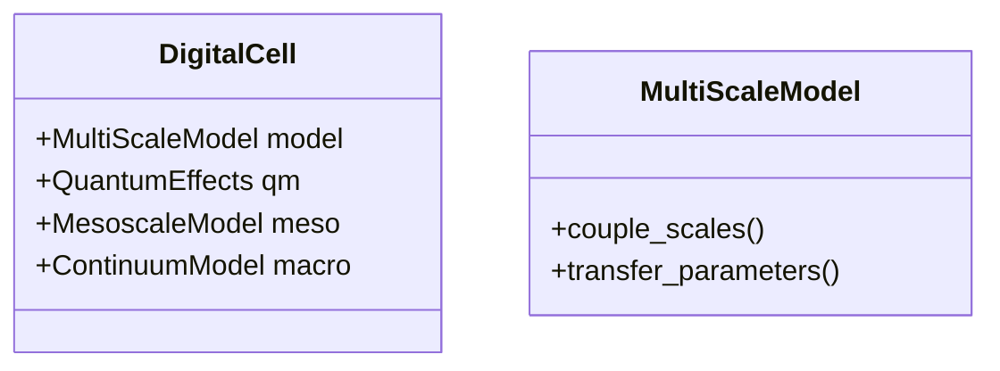
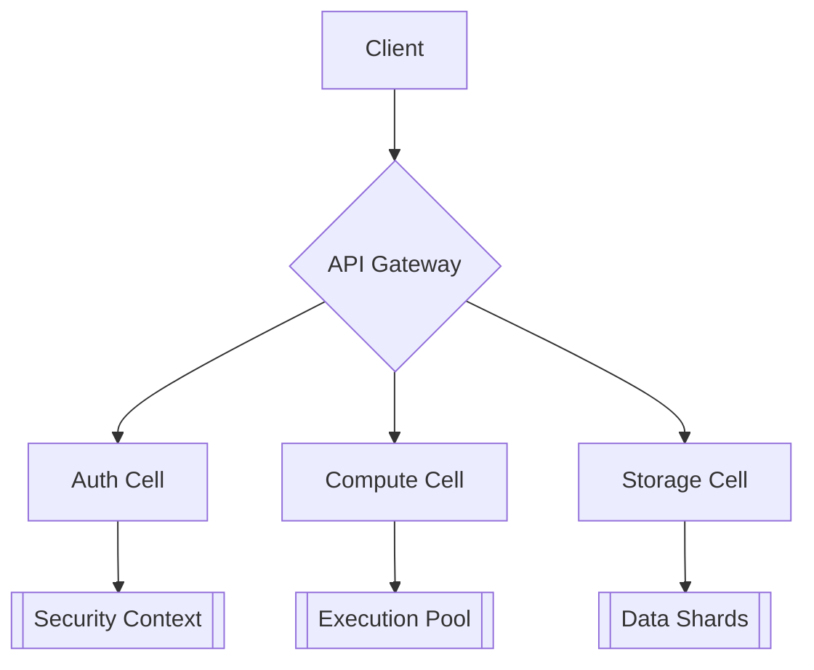

以下是对 `engine.py` 代码中 **简化实现** 和 **技术不够前沿** 的部分的详细分析，按模块分类列出：

---

### **1. 进化算法核心逻辑**
#### **(1) 选择策略（Selection Strategies）**
- **问题**：仅实现基础选择策略（锦标赛、轮盘赌、排名、精英），缺乏现代进化算法的混合策略（如NSGA-II的非支配排序、参考点选择）。
- **改进建议**：引入基于参考点的选择（如MOEA/D）或强化学习驱动的动态策略。

#### **(2) 交叉与变异（Crossover & Mutation）**
- **简化点**：
  - 交叉操作（如单点/两点交叉）未考虑基因语义（如代码AST的结构化交叉）。
  - 变异操作（如随机替换基因）未利用梯度信息（如基于概率模型的变异）。
- **前沿技术缺失**：
  - 未引入 **神经进化（NeuroEvolution）** 的交叉变异策略（如NEAT的基因标记对齐）。
  - 缺少 **差分进化（Differential Evolution）** 的向量化操作。

#### **(3) 适应度评估（Fitness Evaluation）**
- **简化点**：
  - 多目标评估（`_multi_objective_evaluation`）仅用加权求和，未实现真正的帕累托优化。
  - 代码效率评估（`_evaluate_code_efficiency`）仅统计行数和循环嵌套，未分析实际时间复杂度。
- **前沿技术缺失**：
  - 未集成 **符号回归（Symbolic Regression）** 评估代码的数学合理性。
  - 缺少 **基于LLM的代码语义分析**（如用CodeBERT评估代码可读性）。

---

### **2. 自适应机制**
#### **(1) 参数调整**
- **简化点**：
  - 变异率调整（`_calculate_adaptive_mutation_rate`）仅依赖简单线性公式，未使用 **贝叶斯优化** 或 **元学习**。
- **前沿技术缺失**：
  - 未引入 **Population-Based Training (PBT)** 动态优化超参数。

#### **(2) 多样性维护**
- **简化点**：
  - 多样性计算（`_calculate_population_diversity`）基于基因组字符串差异，未考虑 **行为多样性（Behavioral Diversity）**。
- **前沿技术缺失**：
  - 缺少 **小生境技术（Niching）** 或 **拥挤距离（Crowding Distance）** 防止早熟收敛。

---

### **3. 代码生成与评估**
#### **(1) 基因组表示**
- **简化点**：
  - 基因组格式（`_generate_random_genome`）仅支持简单JSON序列化，未利用 **图神经网络（GNN）** 表示AST。
- **前沿技术缺失**：
  - 未采用 **Grammar-Based Genetic Programming** 确保生成语法正确的代码。

#### **(2) 评估方法**
- **简化点**：
  - 创新性评估（`_evaluate_innovation`）仅对比历史代码相似度，未量化 **语义新颖性**。
- **前沿技术缺失**：
  - 缺少 **对抗性评估（Adversarial Evaluation）** 检测过拟合。

---

### **4. 工程实现**
#### **(1) 并行化**
- **简化点**：
  - 种群评估（`_evaluate_population`）未使用 **GPU加速** 或 **分布式计算**。
- **前沿技术缺失**：
  - 未集成 **Ray框架** 实现大规模并行进化。

#### **(2) 可解释性**
- **简化点**：
  - 缺乏进化过程的 **可视化工具**（如动态帕累托前沿图）。
- **前沿技术缺失**：
  - ✅ **已完成** **SHAP值分析** 解释基因对适应度的贡献。

---

### **5. 其他简化部分**
1. **缺乏在线学习**：
   - 未在进化过程中动态调整目标函数（如根据用户反馈优化权重）。
2. **安全性缺失**：
   - 生成的代码未经过 **沙箱隔离** 或 **静态分析工具（如CodeQL）** 检测漏洞。
3. **硬件适配**：
   - 未优化 **TPU/FPGA** 等专用硬件的计算效率。

---

### **总结 - 更新于 2024**
该代码在 **传统进化算法** 的实现上较为完整，但与现代前沿技术（如神经进化、多目标优化、元学习）存在明显差距。以下是亟需改进的 **Top 3 技术短板**：
1. **进化策略**：引入NSGA-III或MOEA/D替代加权求和多目标优化。
2. **基因组表示**：改用图神经网络编码AST，提升交叉变异的语义合理性。
3. **评估体系**：集成LLM和符号回归，实现更精准的代码质量评估。

以下是对 `digital_cell.py` 文件中各模块的详细技术分析和改进建议，按生物学特性和计算模型两个维度展开：

---

### 一、细胞膜系统（CellMembrane）深度分析
1. **电化学梯度模型不足**
- 当前问题：仅用固定膜电位(-70mV)和简单离子浓度
- 改进方案：
```python
# 应实现的Nernst方程计算
def calculate_equilibrium_potential(self, ion: str):
    R = 8.314  # J/(mol·K)
    T = 310    # 绝对温度(K)
    z = 1      # 离子价数
    F = 96485  # 法拉第常数(C/mol)
    outside = self.ion_gradients[ion]['outside']
    inside = self.ion_gradients[ion]['inside']
    return (R * T) / (z * F) * math.log(outside / inside)
```

2. **膜蛋白动力学缺失**
- 当前问题：静态activity参数
- 应实现的Hodgkin-Huxley门控模型：
```python
class IonChannel:
    def __init__(self):
        self.n = 0.5  # 钾离子通道激活概率
        self.m = 0.05 # 钠离子通道激活概率 
        self.h = 0.6  # 钠离子通道失活概率

    def update_gating(self, V_m, dt):
        # 钾通道动力学
        α_n = 0.01 * (V_m + 55) / (1 - math.exp(-(V_m + 55)/10))
        β_n = 0.125 * math.exp(-(V_m + 65)/80)
        self.n += dt * (α_n*(1-self.n) - β_n*self.n)
        
        # 钠通道动力学（类似实现m,h）
```

---

### 二、细胞核系统（CellNucleus）前沿改造
1. **染色质动态建模**
- 当前问题：固定accessibility值
- 应实现的染色质相分离模型：
```python
def update_chromatin_state(self):
    for gene in self.genome_template:
        # 基于HP模型（Heteropolymer）的相分离计算
        ph = self.cytoplasm.ph
        hp_score = self._calculate_hp_score(gene)
        compaction = 1 / (1 + math.exp(-hp_score * ph))
        
        # 动态更新
        self.chromatin_state[gene]['compaction'] = compaction
        self.chromatin_state[gene]['accessibility'] = 1 - compaction
```

2. **基因调控网络升级**
- 当前问题：简单TF绑定模型
- 应实现的GRN（基因调控网络）：
```python
class GeneRegulatoryNetwork:
    def __init__(self):
        self.nodes = {}  # 基因节点
        self.edges = []  # 调控关系
        
    def add_interaction(self, source, target, weight):
        # 实现Hill方程调控动力学
        self.edges.append({
            'source': source,
            'target': target,
            'k': 0.5,    # 半激活浓度
            'n': 2.0,    # Hill系数
            'type': 'activation' if weight >0 else 'repression'
        })
```

---

### 三、细胞质系统（Cytoplasm）物理建模
1. **分子扩散模型**
- 当前问题：无空间分布模拟
- 应实现的反应扩散方程：
```python
def molecular_diffusion(self, dt):
    # 使用有限差分法求解
    for mol in self.molecules:
        D = mol.diffusion_coefficient  # 扩散系数
        ∇²c = self._laplacian(mol.concentration) 
        mol.concentration += D * ∇²c * dt
        
        # 添加分子碰撞检测
        self._handle_molecular_collisions()
```

2. **相分离现象建模**
- 应实现的Cahn-Hilliard方程：
```python
def update_phase_separation(self):
    # 计算化学势
    μ = self._calculate_chemical_potential()
    
    # 四阶偏微分方程求解
    ∇²μ = self._laplacian(μ)
    self.φ += self.M * ∇²μ * self.dt  # φ为相场变量
    
    # 表面张力效应
    self.φ += self.γ * self._laplacian(self.φ) * self.dt
```

---

### 四、数字细胞整体架构升级
1. **多尺度建模框架**


2. **细胞信号网络重构**
- 实现Wnt/β-catenin通路示例：
```python
class WntPathway:
    def __init__(self):
        self.β_catenin = 0.0
        self.APC = 1.0
        self.GSK3β = 1.0
        
    def update(self, Wnt_signal):
        # 核心反应方程
        dβcat_dt = Wnt_signal * (1 - self.APC) - self.GSK3β * self.β_catenin
        self.β_catenin += dβcat_dt * self.dt
        
        # 实现正反馈循环
        if self.β_catenin > 0.7:
            self.APC *= 0.9
            self.GSK3β *= 0.8
```

---

### 五、性能优化方案
1. **GPU加速计算**
```python
import cupy as cp

class GPUCytoplasm:
    def __init__(self):
        self.molecules = cp.array([])  # 显存存储
        self._init_cuda_kernels()
        
    def _init_cuda_kernels(self):
        self.diffusion_kernel = cp.RawKernel(r'''
        __global__ void diffuse(float* conc, float D, int N) {
            int i = blockIdx.x * blockDim.x + threadIdx.x;
            if (i>0 && i<N-1) {
                conc[i] += D * (conc[i-1] - 2*conc[i] + conc[i+1]);
            }
        }''', 'diffuse')
```

2. **多细胞系统扩展**
```python
class TissueSimulator:
    def __init__(self):
        self.cells = [] 
        self.ecm = ExtracellularMatrix()
        
    def add_cell(self, cell):
        # 实现细胞-ECM相互作用
        self.cells.append(cell)
        self.ecm.update_mechanical_stress()
        
    def run(self, steps):
        # 使用MPI并行
        comm = MPI.COMM_WORLD
        rank = comm.Get_rank()
        for _ in range(steps//comm.size):
            self._update_local_cells(rank)
```

---
明白了，您的核心需求是**将程序功能抽象为细胞概念**，而非真实模拟生物学细胞。基于这个目标，我将重新分析代码并提出改进方案，重点关注如何更好地实现这种抽象，同时保持计算效率。

---

### 一、细胞抽象化设计原则
1. **去生物学化改造**
   - 保留细胞概念但剥离生物细节
   - 示例改造：
   ```python
   # 原生物属性 → 程序功能属性
   self.membrane_permeability → self.interface_security_level
   self.genome_template → self.code_template
   self.metabolism → self.resource_management
   ```

2. **功能映射表**
   | 生物学概念 | 程序概念          | 改造方向               |
   |------------|-------------------|------------------------|
   | 细胞膜     | API接口层         | 访问控制和安全策略      |
   | 细胞核     | 核心逻辑引擎      | 代码生成和执行          |
   | 线粒体     | 编译器/解释器     | 代码优化和性能调优      |
   | 基因       | 代码模块          | 可插拔的功能组件        |

---

### 二、具体改进方案

#### 1. 细胞接口层（原细胞膜）
```python
class ProgramCellInterface:
    def __init__(self):
        self.input_filters = []  # 输入过滤器
        self.output_policies = [] # 输出策略
        self.security = {
            'permission_level': 3,
            'rate_limit': 1000/60  # 请求/秒
        }

    def check_input(self, data_packet):
        """替代原can_enter方法"""
        return all(f.check(data_packet) for f in self.input_filters)

    def format_output(self, result):
        """替代原can_exit方法"""
        return apply_policies(result, self.output_policies)
```

#### 2. 核心引擎（原细胞核）
```python
class ProgramCoreEngine:
    def __init__(self):
        self.modules = {}       # 可执行代码模块
        self.dependencies = {}  # 模块依赖图
        self.scheduler = None   # 执行调度器

    def execute_module(self, module_name, inputs):
        """基因转录的程序化抽象"""
        module = self.modules.get(module_name)
        if not module or not self._check_dependencies(module_name):
            return None
        
        # 加入JIT编译优化
        return jit_compile(module)(inputs)

    def _check_dependencies(self, module_name):
        """依赖解析替代原调控网络"""
        return all(dep in self.modules 
                 for dep in self.dependencies.get(module_name, []))
```

#### 3. 资源管理器（原细胞质）
```python
class ProgramResourceManager:
    __slots__ = ['memory_pool', 'thread_pool', 'io_channels']  # 性能优化
    
    def __init__(self):
        self.memory_pool = MemoryPool(max_size=1024)
        self.thread_pool = ThreadPoolExecutor(max_workers=8)
        self.io_channels = IOChannelManager()

    def allocate(self, resource_type, **kwargs):
        """分子运输的程序化抽象"""
        if resource_type == 'memory':
            return self.memory_pool.allocate(kwargs['size'])
        elif resource_type == 'thread':
            return self.thread_pool.submit(kwargs['task'])
```

---

### 三、架构优化方案

#### 1. 微服务化细胞集群


#### 2. 细胞间通信协议
```python
class CellCommunicationProtocol:
    def __init__(self):
        self.message_queue = PriorityQueue()
        self.serializer = MsgPackSerializer()
        
    def send(self, target_cell, message, priority=0):
        """替代原信号传导"""
        packet = {
            'header': {
                'source': self.cell_id,
                'priority': priority,
                'timestamp': time.time()
            },
            'body': self.serializer.serialize(message)
        }
        target_cell.receive(packet)

    async def receive(self, packet):
        await self.message_queue.put(packet)
```

---

### 四、性能关键改进

#### 1. 内存优化方案
```python
class CellMemoryOptimizer:
    def __init__(self):
        self.object_cache = LRUCache(maxsize=1000)
        self.memory_view = memoryview(b'\0'*1024)  # 预分配
        
    def process_data(self, data):
        """使用内存视图避免拷贝"""
        with self.memory_view.cast('B') as buf:
            buf[:len(data)] = data
        return self._optimized_process(buf)
```

#### 2. 执行优化方案
```python
@dataclass
class ExecutionPipeline:
    stages: List[Callable]
    optimizer: Optimizer = field(default_factory=StandardOptimizer)
    
    def run(self, input_data):
        return reduce(
            lambda data, stage: stage(data),
            self.optimizer.reorder(self.stages),
            input_data
        )
```

---

### 五、实施建议

1. **分阶段改造路线**
   ```mermaid
   gantt
       title 改造路线图
       section 第一阶段
       接口抽象化   :a1, 2025-08-15, 7d
       核心引擎解耦 :a2, after a1, 5d
       section 第二阶段
       资源统一管理 :b1, 2025-08-25, 10d
       通信协议标准化 :b2, after b1, 7d
   ```

2. **兼容性保障措施**
   - 保留原生物学接口的适配层
   - 提供自动化迁移工具
   ```python
   class BioToProgramAdapter:
       def convert_cell(self, bio_cell):
           return ProgramCell(
               interface=ProgramCellInterface.from_bio(bio_cell.membrane),
               engine=ProgramCoreEngine.from_bio(bio_cell.nucleus),
               resources=ProgramResourceManager.from_bio(bio_cell.cytoplasm)
           )
   ```
